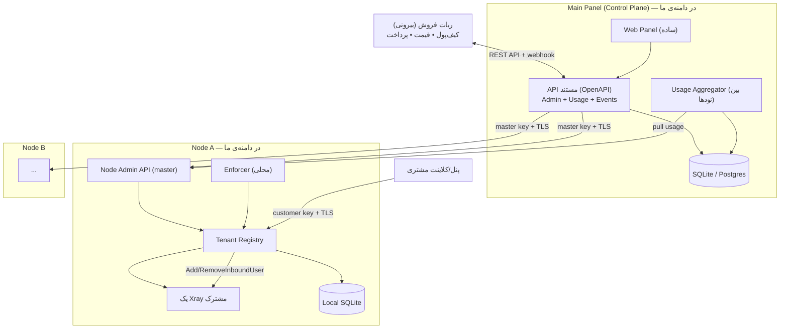

# PasarGuard Node-as-a-Service — پلن پروداکشن (نسخه‌ی سبک / Public Release)

> سند طراحی برای ساخت یک سامانه‌ی فروش نود چند-مستأجری با سهمیه‌ی حجم، بر پایه‌ی فورک `PasarGuard/node`.
> این نسخه برای **انتشار عمومی (open-source)** طراحی شده: ساده، سبک، فقط در حد نیاز. امکانات پیشرفته بعد از حمایت/دونیت اضافه می‌شوند (بخش «کارهای آینده»).

---

## ۰. تصمیم‌های معماری کلیدی (نسخه‌ی سبک)

| تصمیم | انتخاب | دلیل |
|---|---|---|
| تعداد Xray | **یک Xray مشترک برای همه‌ی مشتری‌ها** | سبک، کم‌مصرف؛ چون کانفیگ برای همه ثابت است |
| جداسازی مستأجر | **بر اساس کاربر (user/email)، نه پروسه** | بدون سربار پروسه‌ی جدا |
| کانفیگ | **ثابت، توسط اپراتور (تو) تعریف می‌شود** | مشتری کانفیگ نمی‌فرستد |
| سرتیفیکیت | **ثابت، بدون چرخش** | ساده‌سازی |
| Sanitizer کانفیگ | **حذف شد** | مشتری اصلاً به کانفیگ هسته دست نمی‌زند (حل با طراحی) |
| enforcement | **حذف کاربرهای مستأجر در لحظه** (نه stop کردن core) | core مشترک است؛ بقیه نباید قطع شوند |
| کیف‌پول/قیمت/پرداخت | **بیرون از پنل (ربات فروش)** | پنل فقط متر و کنترل می‌دهد |
| مدیریت چند نود | **در دامنه** | پنل اصلی یک fleet را اداره می‌کند |
| WireGuard، multi-region، HA، Vault | **فعلاً نه** | بعد از دونیت |

---

## ۱. هدف و دامنه

ساخت پلتفرمی برای **فروش دسترسی نود VPN با سهمیه‌ی حجم**:

- یک **پنل اصلی (Main Panel)** که با **کلید مستر چندین نود** را اداره می‌کند (fleet).
- هر نود **یک Xray مشترک** با کانفیگ ثابت دارد و **چند مشتری (tenant)** را با کاربرهایشان سرویس می‌دهد.
- هر مشتری یک **کلید API محدود** و یک **پلن (سهمیه‌ی حجم، انقضا، سقف کاربر)** دارد.
- مشتری فقط **کاربر اضافه/حذف می‌کند**؛ به کانفیگ/هسته دسترسی ندارد.
- با **اتمام حجم یا انقضا**: کاربرهای آن مشتری از Xray حذف و disconnect می‌شوند و دسترسی کلیدش رد می‌شود؛ بقیه‌ی مشتری‌ها دست‌نخورده می‌مانند.
- پنل اصلی مصرف/مصرف‌اضافه را **دقیق اندازه می‌گیرد و از طریق API + webhook expose می‌کند** تا سیستم‌های بیرونی (ربات فروش) بیلینگ کنند.

### ۱.۱ مرز مسئولیت (مهم)
**در دامنه‌ی این پروژه:** فقط **Node Agent** و **پنل اصلی** + **مستندات API پنل اصلی** (OpenAPI).

پنل اصلی شامل:
- مدیریت **چند نود** (ثبت، push کانفیگ، تجمیع مصرف، سلامت).
- مدیریت مشتری/پلن/کلید/سهمیه/انقضا + کنترل suspend/resume + افزودن حجم/زمان.
- اندازه‌گیری دقیق مصرف و مصرف‌اضافه و expose از طریق API/webhook.

**خارج از دامنه (مسئولیت سیستم بیرونی مثل ربات فروش):**
- کیف‌پول، موجودی، منفی‌شدن حساب، قیمت‌گذاری، درگاه پرداخت، فاکتور.
- ربات از API پنل اصلی استفاده می‌کند: مصرف را می‌خواند، کیف‌پول خودش را منفی می‌کند، و با فراخوانی API پنل (suspend/topup-quota/extend) عمل می‌کند.

### خارج از دامنه‌ی فنی این نسخه (موکول به آینده)
WireGuard، orchestration پیشرفته (auto-migration/scheduling/IP-pool)، HA دیتابیس، Vault، tracing، chaos.

---

## ۲. معماری کلان



### اصول
1. **یک Xray، چند مستأجر بر اساس user.** هیچ پروسه‌ی اضافه‌ای spawn نمی‌شود.
2. **کانفیگ و cert ثابت** — اپراتور تعریف می‌کند، مشتری دست نمی‌زند.
3. **enforcement محلی روی نود** — قطعی پنل اصلی سرویس را نمی‌شکند.
4. **دو سطح دسترسی:** master (پنل اصلی) و tenant (مشتری).
5. **پنل بدون منطق پول.** فقط متر می‌کند و expose می‌کند؛ بیلینگ بیرون است.
6. **پنل اصلی یک fleet از نودها را اداره می‌کند.**

---

## ۳. مدل چند-مستأجری روی یک Xray مشترک (هسته‌ی طراحی)

### ۳.۱ نگاشت‌ها
- `customer_api_key → tenant_id`
- `user_email → tenant_id`
- برای جلوگیری از تداخل، email هر کاربر به‌صورت داخلی namespace می‌شود: `t{tenant_id}.{email}`.
- credential کاربر (uuid برای vless/vmess، password برای trojan/ss) باید یکتا باشد؛ نود هنگام add یکتایی را تضمین می‌کند.

### ۳.۲ چرخه‌ی زندگی کاربر
- مشتری با کلید خودش `SyncUsers` می‌زند → نود کاربرها را به inboundهای ثابت اضافه می‌کند (`AddInboundUser`) و در registry به tenant نسبت می‌دهد.
- حذف کاربر → `RemoveInboundUser`.
- این عملیات **runtime** است و نیازی به restart هسته ندارد (در کد فعلی نود موجود است).

### ۳.۳ پشتیبانی کد موجود
کد فعلی `backend/xray` این‌ها را دارد و مستقیماً بازاستفاده می‌شوند:
- `api.AddInboundUser` / `api.RemoveInboundUser` — add/remove در لحظه.
- `api.GetUsersStats(reset)` — ترافیک per-user (uplink/downlink).
- `GetUserOnlineStats` / `GetUserOnlineIpListStats` — آنلاین‌ها و IP هم‌زمان.

تنها چیزی که اضافه می‌کنیم: لایه‌ی **Tenant Registry + Enforcer** روی این‌ها.

---

## ۴. احراز هویت دو سطحی (ساده)

روی هر نود:

- **Master-scope** (پنل اصلی): با **Master Key** روی TLS (mTLS اختیاری، به آینده موکول). دسترسی: ست‌کردن کانفیگ مشترک، ساخت/حذف tenant، تنظیم سهمیه، suspend/resume، خواندن آمار همه.
- **Tenant-scope** (مشتری): با **Customer API Key** روی TLS. فقط کاربرهای خودش + آمار خودش. enforcement سهمیه/انقضا روی هر درخواست.

```
درخواست → TLS
  ├── Master Key؟ → master scope
  └── x-api-key مشتری؟ → resolve tenant → چک فعال/سهمیه/انقضا → tenant scope
```

- کلید مشتری: UUID v4، در DB فقط **hash** ذخیره می‌شود.
- ابطال/چرخش کلید بدون حذف tenant.

---

## ۵. حسابداری مصرف و Enforcement

### ۵.۱ اندازه‌گیری
- Enforcer محلی هر چند ثانیه `GetUsersStats(reset=true)` را می‌خواند، **delta** هر کاربر را به شمارنده‌ی tenant اضافه می‌کند، و در local store persist می‌کند (تا reset/overflow هسته مشکل نسازد).
- جمع کاربرهای یک مشتری = مصرف آن مشتری.

### ۵.۲ منطق (با credit limit)
به‌جای قطع دقیقاً سر سهمیه، یک **credit_limit** (سقف بدهکاری مجاز بر حسب بایت) داریم. این هم مصرف اضافه را قابل‌حساب می‌کند هم گزینه‌ی postpaid را:
```
if tenant.status != active                         → reject
if now > tenant.expire_at                          → suspend("expired"); reject
if tenant.used_bytes >= quota + tenant.credit_limit → suspend("quota"); reject (ResourceExhausted)
```
- **Hard cap:** `credit_limit = 0` → عملاً سر سهمیه قطع؛ فقط overshootِ بازه‌ی poll به‌عنوان مصرف اضافه باقی می‌ماند (دقیق ثبت و بیل می‌شود).
- **Postpaid:** `credit_limit > 0` → مشتری می‌تواند تا سقف بدهکاری ادامه دهد؛ همه‌ی مصرف اضافه بیل می‌شود.
- **poll تطبیقی:** برای tenantهای نزدیک سقف، بازه‌ی poll کوتاه‌تر (مثلاً ۲ثانیه) تا overshoot کمینه شود.

### ۵.۳ Suspend ≠ Delete (مهم — جلوگیری از پریدن داده)
enforcementِ اتمام حجم **Suspend** است، نه Delete:
- **Suspend:** کاربرهای tenant فقط از Xrayِ **در حال اجرا** با `RemoveInboundUser` حذف می‌شوند (اتصال‌ها drop)، ولی **رکورد کاربر (email/credential/نگاشت) در local store نگه داشته می‌شود.**
- **Delete (فقط):** `DeleteTenant` از پنل اصلی (خروج دائم مشتری) یا `RemoveUsers` صریح خود مشتری.

پس اگر مشتری یادش برود و بعداً تمدید کند، داده‌اش محفوظ است و با **همان credentialها** برمی‌گردد؛ لینک‌های اشتراک کاربرهای نهایی دوباره کار می‌کنند.

### ۵.۴ Reconcile محلی gated-by-status (جلوگیری از دور زدن سهمیه با sync پنل)
پنل مشتری به‌صورت دوره‌ای `SyncUsers` می‌زند. نود یک reconcile محلی دارد که اعمال روی Xray را به وضعیت tenant مشروط می‌کند:
```
کاربرهای واقعیِ روی Xray =
    tenant active    → همه‌ی کاربرهایش اعمال می‌شوند
    tenant suspended → هیچ‌کدام (ولی رکوردها در registry نگه داشته می‌شوند)

روی SyncUsers از مشتری:
    - registry همیشه بروز می‌شود (لیست کاربرها)
    - اعمال روی Xrayِ زنده فقط اگر tenant active باشد
```
نتیجه: حتی اگر پنلِ مشتریِ suspend‌شده مدام sync بزند، کاربرها به Xray برنمی‌گردند و سهمیه دور زده نمی‌شود. این رفتار هم‌زمان یک مسیر **self-healing** است: اگر local store نود پاک شود، sync بعدیِ پنل (برای tenantهای active) کاربرها را بازمی‌سازد.

> **تقسیم منبع حقیقت:** لیست کاربرها ← پنل مشتری (نود cache). سهمیه/مصرف/وضعیت tenant ← نود (محلی و مقاوم).

### ۵.۵ تمدید/ریست
- reset دوره‌ای یا top-up: `used_bytes=0`, `status=active`؛ reconcile کاربرهای نگه‌داشته‌شده را با همان credentialها دوباره `AddInboundUser` می‌کند.

### ۵.۶ سهمیه‌ی per-user (اختیاری، سبک)
علاوه بر سهمیه‌ی کل مشتری، می‌توان سقف per-user هم گذاشت (همان منطق روی email تک).

### ۵.۷ حسابداری مصرف اضافه (Overage) و expose برای بیلینگ بیرونی
هدف: هر بایتِ مصرف‌شده — حتی فراتر از سهمیه — دقیق ثبت و از طریق API/webhook به سیستم بیرونی (ربات فروش) گزارش شود. **پنل خودش پول/کیف‌پول ندارد**؛ فقط داده‌ی دقیق و قابل‌اتکا می‌دهد و ربات کیف‌پول را منفی می‌کند.

**اندازه‌گیری دقیق (crash-safe):**
- نود برای هر دوره (`period_id`) یک شمارنده‌ی **تجمعی مطلق** `used_bytes` نگه می‌دارد (از delta‌های Xray با reset، persist در local store). چون از خود Xray خوانده می‌شود، شامل overshootِ بازه‌ی poll هم هست → هیچ بایتی گم نمی‌شود.
- `overage_bytes = max(0, used_bytes - quota_bytes)`.

**تجمیع چندنودی:** اگر یک مشتری روی چند نود tenant داشته باشد، پنل `used_bytes` همه‌ی نودهای آن مشتری را جمع می‌کند → مصرف کل مشتری. برای مشتری تک‌نودی، شمارش محلی نود دقیق است؛ برای چندنودی، تجمیع در پنل + هماهنگی suspend (overshoot ناچیز بین نودها هم دقیق ثبت و expose می‌شود).

**expose به بیرون (idempotent):**
- API: `GET /customers/{id}/usage` مقدار **مطلق تجمعی** `used_bytes` + `overage_bytes` + `period_id` را می‌دهد. ربات با همین مقدار مطلق، delta نسبت به آخرین بار را خودش حساب و کیف‌پول را شارژ می‌کند (تکرار = بی‌اثر).
- Webhook: `usage.threshold` (۸۰٪/۹۵٪)، `usage.over_quota` (با `overage_bytes`)، `subscription.suspended/expired`. ربات این‌ها را مصرف و کیف‌پول را منفی می‌کند.

**کنترل از سمت ربات (postpaid/تسویه):**
- ربات بعد از تصمیم مالی، با API پنل عمل می‌کند: `topup-quota` (افزودن بایت)، `extend` (تمدید زمان)، `suspend`/`resume`، یا ست‌کردن `credit_limit_bytes` (سقف بایتِ مجاز برای ادامه‌ی postpaid قبل از suspend خودکار).
- `credit_limit_bytes` یک پارامتر **enforcement بر حسب بایت** است (نه پول) که ربات بر اساس موجودی کیف‌پول ست می‌کند. پیش‌فرض `0` = قطع سر سهمیه.

**مقاوم به crash:** مبنا «مقدار مطلق تجمعی + idempotent» است (نه delta سیمی)، پس restart نود یا قطعی پنل باعث بیل دوباره یا گم‌شدن بایت نمی‌شود. در reset دوره، `period_id` افزایش می‌یابد.

---

## ۶. تغییرات لازم روی فورک نود

کد فعلی: تک‌مستر، تک‌کلید، مشتری کانفیگ می‌فرستد. تغییرات سبک:

1. **حذف رفتار تک‌مستر:** متد `Start` فعلی با هر اتصال جدید قبلی را disconnect می‌کند؛ این حذف/تبدیل می‌شود.
2. **کانفیگ ثابت:** به‌جای دریافت کانفیگ از مشتری، نود کانفیگ را از فایل/Master API می‌گیرد و یک‌بار Xray را بالا می‌آورد.
3. **Auth دو سطحی:** بازنویسی `controller/rpc/middleware.go` برای master/tenant.
4. **Tenant Registry:** نگاشت key→tenant و user→tenant + local store (SQLite).
5. **Customer API محدود:** فقط `SyncUsers`/`RemoveUsers`/`GetMyUsage`/`GetMyUsers` (scope-شده به tenant).
6. **Node Admin API (master):** `SetConfig`, `CreateTenant`, `SetQuota`, `Suspend/Resume`, `DeleteTenant`, `GetAllStats`, `Health`.
7. **Enforcer:** حلقه‌ی پس‌زمینه برای جمع آمار و اعمال سهمیه با remove user.

> ساختار `backend/xray` تقریباً بدون تغییر می‌ماند؛ بیشتر کار در لایه‌ی `controller` است.

---

## ۷. مدل داده (سبک)

### پنل اصلی (SQLite برای شروع، قابل ارتقا به Postgres)
> پنل **منطق پول ندارد**. مبالغ/کیف‌پول/قیمت در ربات فروش است. پنل فقط بایت/زمان/وضعیت را نگه می‌دارد.
```sql
admins(id, email, password_hash, created_at)
customers(id, name, status, external_ref, created_at)   -- external_ref = شناسه‌ی مشتری در ربات فروش
plans(id, name, quota_bytes, duration_days, max_users, created_at)  -- بدون قیمت
subscriptions(id, customer_id, plan_id, status, period_id, start_at, end_at,
              quota_bytes, used_bytes, credit_limit_bytes, created_at)
api_keys(id, customer_id, key_hash, prefix, status, created_at)
nodes(id, name, address, status, version, capacity_score, last_seen_at, created_at)
tenants(id, customer_id, node_id, status, created_at)   -- حضور مشتری روی هر نود (می‌تواند چند نود)
usage_records(id, tenant_id, node_id, period_id, ts, used_bytes_cumulative)  -- مطلق تجمعی (idempotent)
webhook_endpoints(id, url, secret, events text[], status)   -- مقصد رویداد برای ربات
webhook_deliveries(id, endpoint_id, event, payload, status, attempts, ts)
audit_logs(id, actor, action, target, ts)
```

### Local store نود (SQLite)
```sql
tenants(api_key_hash, tenant_id, status, period_id, quota_bytes,
        used_bytes, credit_limit_bytes, expire_at)
users(email, tenant_id, proxy_blob, added_at)
usage_counters(tenant_id, period_id, used_bytes_cumulative, last_reported_at)
node_config(version, config_blob)   -- کانفیگ ثابت
```
نود با این داده حتی بدون پنل اصلی enforcement را ادامه می‌دهد.

---

## ۸. APIها

API پنل اصلی **سطح یکپارچه‌سازی** است؛ ربات فروش فقط با همین کار می‌کند. کامل با **OpenAPI 3** مستند می‌شود (بخش ۸.۵).

### ۸.۱ Master (پنل اصلی → نود) — gRPC/TLS با master key
```
SetNodeConfig(config)          ست‌کردن کانفیگ ثابت مشترک + (در صورت تغییر) restart کنترل‌شده
CreateTenant(tenant_id, customer_key, quota, expire_at, max_users, credit_limit)
SetQuota(tenant_id, quota, expire_at, credit_limit)
SuspendTenant / ResumeTenant / DeleteTenant(tenant_id)
GetAllStats() / GetTenantUsage(tenant_id) / GetNodeHealth()
RotateCustomerKey(tenant_id, new_key)
```

### ۸.۲ Customer (مشتری → نود) — scope‌شده با customer key
```
SyncUsers(users)      add/update کاربرهای tenant خودش
RemoveUsers(emails)
GetMyUsers()
GetMyUsage()          مصرف، مصرف اضافه، و باقی‌مانده‌ی سهمیه
```

### ۸.۳ Public API پنل اصلی (ربات فروش → پنل) — REST + Bearer token
```
# مشتری و دسترسی
POST   /api/v1/customers                     ساخت مشتری (external_ref به ربات)
POST   /api/v1/customers/{id}/keys           صدور کلید (متن کامل فقط یک‌بار)
DELETE /api/v1/keys/{id}                       ابطال کلید

# پلن و اشتراک
POST   /api/v1/plans
POST   /api/v1/customers/{id}/subscriptions   تخصیص پلن (روی نود/نودهای مشخص)
POST   /api/v1/subscriptions/{id}/topup-quota  افزودن بایت
POST   /api/v1/subscriptions/{id}/extend       تمدید زمان
POST   /api/v1/subscriptions/{id}/reset        ریست دوره (period_id++)
POST   /api/v1/subscriptions/{id}/suspend      قطع دستی (ربات بر اساس کیف‌پول)
POST   /api/v1/subscriptions/{id}/resume
PATCH  /api/v1/subscriptions/{id}/credit-limit ست credit_limit_bytes

# مصرف (برای بیلینگ بیرونی)
GET    /api/v1/customers/{id}/usage           used/overage مطلق تجمعی + period_id
GET    /api/v1/customers/{id}/usage/history

# نودها (مدیریت fleet)
POST   /api/v1/nodes                           ثبت نود
GET    /api/v1/nodes / GET /api/v1/nodes/{id}/health
POST   /api/v1/nodes/{id}/config               push کانفیگ ثابت

# webhookها
POST   /api/v1/webhooks                        ثبت مقصد رویداد + secret
```

### ۸.۴ گزارش مصرف نود → پنل اصلی (داخلی، idempotent)
```
ReportUsage(node_id, [{tenant_id, period_id, used_bytes_cumulative}])
   پنل: max می‌گیرد و بین نودهای یک مشتری تجمیع می‌کند → used/overage کل
```

### ۸.۵ Webhook/Event پنل → ربات فروش (HMAC-signed)
```
usage.threshold        رسیدن به ۸۰٪/۹۵٪
usage.over_quota       عبور از سهمیه { customer_id, overage_bytes, period_id }
subscription.suspended / subscription.resumed / subscription.expired
node.down / node.recovered
```
> پنل پول/کیف‌پول ندارد؛ ربات با این رویدادها و `GET /usage` کیف‌پول خودش را منفی/شارژ می‌کند و در صورت لزوم `suspend`/`resume`/`topup-quota` صدا می‌زند.

### ۸.۶ مستندات API (الزامی)
- **OpenAPI 3 (swagger.json)** برای کل Public API + UI سواگر.
- مستندات webhook (نمونه payload + روش تأیید امضای HMAC).
- نمونه‌ی end-to-end برای ربات: ساخت مشتری → پلن → خواندن مصرف → suspend/resume.

---

## ۹. ریسک‌ها و trade-offها (آگاهانه)

| مورد | اثر | وضعیت |
|---|---|---|
| **Blast radius مشترک** | crash هسته = قطع همه | پذیرفته؛ health-check + auto-restart فعلی نود |
| **Noisy neighbor** | مصرف زیاد یکی روی بقیه | سقف سرعت per-user با policy levels (سبک، اختیاری) |
| **سقف مقیاس یک Xray** | محدودیت تعداد کاربر/کانکشن | برای لانچ کافی؛ sharding به آینده |
| **عدم سفارشی‌سازی کانفیگ توسط مشتری** | همه inbound یکسان | دقیقاً هدف است (کانفیگ ثابت) |
| دقت شمارش (reset/overflow) | ضرر/over-use | شمارنده‌ی مطلق تجمعی + persist محلی + گزارش idempotent |
| مصرف اضافه (overshoot بازه‌ی poll) | کمی فراتر از سهمیه | دقیق ثبت و از طریق API/webhook به بیلینگ بیرونی expose می‌شود (بخش ۵.۷)؛ poll تطبیقی برای کمینه‌کردن |

---

## ۱۰. پشته‌ی فناوری (سبک)

| لایه | انتخاب |
|---|---|
| Node Agent | Go (فورک repo فعلی) |
| Control Plane | Go (chi) — تک باینری |
| دیتابیس | SQLite (ارتقا به Postgres در آینده) |
| Local store نود | SQLite |
| Frontend | یک UI ساده (React یا حتی template سرور-ساید) |
| مستندات API | OpenAPI 3 + Swagger UI |
| استقرار | Docker / docker-compose (مثل فعلی) |

---

## ۱۱. نقشه‌ی راه (سبک)

- **M0 — پایه:** فورک repo، ساختار monorepo (node + panel)، DB schema، build/CI پایه.
- **M1 — Auth دو سطحی + کانفیگ ثابت:** master/tenant، بالاآوردن یک Xray با کانفیگ ثابت.
- **M2 — Tenant Registry + Customer API:** SyncUsers scope‌شده، نگاشت user→tenant، local store.
- **M3 — Enforcer + حسابداری مصرف اضافه:** جمع آمار per-user، سهمیه/credit-limit/انقضا، قطع با remove user، تمدید/ریست، شمارنده‌ی تجمعی idempotent و overage.
- **M4 — پنل اصلی + مدیریت چند نود:** ثبت/مدیریت fleet، push کانفیگ، تجمیع مصرف بین نودها، مدیریت مشتری/پلن/کلید/سهمیه، suspend/resume، Public API + webhookها.
- **M5 — مستندات API (OpenAPI) + پنل وب ساده + مستندات انتشار عمومی + نمونه‌ی یکپارچه‌سازی ربات.**

هر مرحله با تست و مستندسازی پایه.

---

## ۱۲. کارهای آینده (بعد از دونیت/حمایت)

- WireGuard چند-مستأجری.
- Orchestration پیشرفته: scheduling هوشمند، auto-migration بین نودها، IP/port pool.
- HA (Postgres replica، چند replica پنل)، Vault برای secrets.
- mTLS کامل، چرخش خودکار گواهی.
- Observability کامل (Prometheus/Grafana/Loki/Tracing)، alerting.
- گزینه‌ی Xray ایزوله per-tenant برای پلن‌های premium.
- Load/soak/chaos testing.

> توجه: کیف‌پول/قیمت/پرداخت/فاکتور **هیچ‌وقت** در دامنه‌ی این پروژه نیست؛ مسئولیت ربات فروش بیرونی است. پنل فقط API و رویداد لازم را می‌دهد.

---

## ۱۳. گام بعدی پیشنهادی

شروع از **M0 + M1**: فورک repo در monorepo، اسکلت پنل اصلی، و روی نود: auth دو سطحی + بالاآوردن یک Xray با کانفیگ ثابت. سپس M2 (Tenant Registry) و M3 (Enforcer) که قلب فروش حجم هستند.
